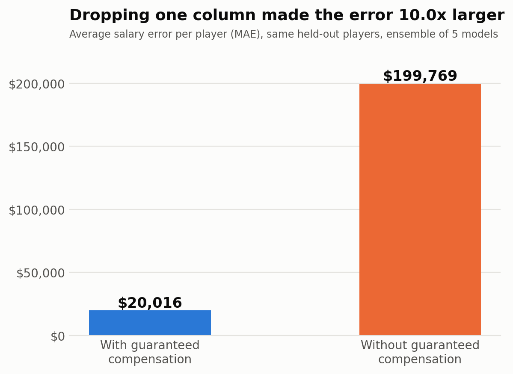

# Predicting Soccer Player Salaries

[](https://github.com/NeilKapoor2/Predicting-Soccer-Player-Salaries/actions/workflows/tests.yml)

**I trained a model to predict MLS salaries and got an R² of 0.99. Then I figured out it was cheating.**

**The short version:** I trained models to predict soccer salaries and got 99% accuracy, then found the model was cheating with a column that was nearly the answer. Removing it showed that salary tracks contracts and negotiation more than skill, so I'm now trying to measure players without using pay.

**The question:** Does salary measure skill?

## Why I built this

I'm a soccer nerd. I'll happily argue that the best player on the pitch is the one who never shows up in the highlights. Salaries are the number everyone quotes when they say a player is "worth it" or "overpaid," so I wanted to see if a computer could learn that number, and what it would end up learning instead.

## The 0.99 mistake

My first MLS model scored an R² of **0.994** (linear regression and decision tree both). Nothing in soccer is that predictable, so I got suspicious and checked what the model was leaning on.

It was almost all one column: `guaranteed_compensation`. I was predicting **base salary** using a number that is mostly base salary plus bonuses. That's like predicting the final score by reading the scoreboard. It's called data leakage, and it's the ML version of a goal that gets chalked off for offside: it looks amazing until someone checks.

So I took the column out.

## The finding

> **My model wasn't learning who was good. It was learning who already got paid.**



On the same held-out players, the ensemble of five models is off by about **$20,000** per player with `guaranteed_compensation` and about **$200,000** without it. That's **10x** the error. Its R² goes from **0.99 to -0.06**, which means that without the column it predicts base salary no better than guessing the average. Random Forest's test MSE went from about 1.8 billion to about 449 billion.

Salary is a stand-in for skill, and it's a biased one. It reflects contracts, age, where a player came from, and how well his agent negotiated. A model trained on it inherits all of that.

## Testing my own test

My first version split the data randomly. But players show up in several seasons, so a random split puts some of a player's seasons in training and others in testing. I suspected the models were partly just remembering names.

I checked ([`split_comparison.py`](split_comparison.py)). In a random split, **82%** of the test rows were players the model had already seen in training. Here is the same experiment both ways:

| Split | Columns | Linear Regression | Random Forest |
|---|---|---|---|
| Random | with `guaranteed_compensation` | R² 0.99, off by $16,799 | R² 0.99, off by $11,698 |
| Random | without it | R² 0.49, off by $117,489 | R² 0.66, off by $81,801 |
| By player | with `guaranteed_compensation` | R² 0.99, off by $15,698 | R² 0.99, off by $14,167 |
| By player | without it | R² -0.25, off by $229,823 | R² -0.27, off by $176,560 |

Two things came out of this:
- The leakage result doesn't depend on the split. The 0.99 is there either way.
- Without the leaked column, the models only looked like they were learning (R² 0.49 to 0.66) because they had seen the same players before. On players they have never seen, they do worse than guessing the average. So I now split by player in both projects.

## Project 2: what if I only use how players actually play?

To test this properly, I built a second model that predicts salary **only** from on-field stats (minutes, goals, assists, xG, xAG, progressive carries/passes/receptions) on a dataset of players from Europe's big leagues (plus MLS).

It got much worse, and that's the honest result. On players it hasn't seen, my best single model (Random Forest) is off by about **$2.4 million** per player on average (test MSE about 1.3 × 10¹³, which is a typical miss of about $3.6M). The stacked models explain about **20%** of the variation in salary (R² 0.20 for the meta neural network). Stats alone don't explain pay.

The biggest misses are fun, though. The model thought Virgil van Dijk (paid about $24.7M in the data) should be making about $5M, and it thought Raheem Sterling (about $22.1M) should be making under $3M. In the other direction, it expected $6.6M or more for Karol Mets, who is paid about $760K. Some of that is probably the model being wrong (stats like these say little about defending), and some may be real gaps between pay and production. I can't tell which yet, and I think that's the actual research question.

## Project 3: scoring players without using salary

[`performance_score.py`](performance_score.py) turns the question around. It scores 1,472 players from production alone (goals, assists, xG, xAG and progressive actions, all per 90 minutes, as a percentile against players in the same league and position). Salary is only used afterward, to see who is paid far above or below what their production suggests. The full list is in [`performance_score_results.csv`](performance_score_results.csv).

- Rank correlation between the score and salary is only **0.29**, so pay follows production loosely.
- The biggest "underpaid" forwards and midfielders include Zavier Gozo (Real Salt Lake), Romano Schmid (Werder Bremen) and Jeremy Doku (Manchester City). The biggest "overpaid" include Geoffrey Kondogbia and Casemiro.
- I don't trust that second list much. Kondogbia and Casemiro are defensive midfielders, and my score can't see defending. The score also rates Erling Haaland at only 41 out of 100 because it rewards ball progression, while it rates Lionel Messi at 96. So the score is a starting point for questions, not a verdict on any player.

## What's in here

| File | What it is |
|------|-----------|
| `predicting_player_salaries.py` / `Predicting_Player_Salaries.ipynb` | Project 1: MLS base salaries, including the leakage test |
| `performance_based_salaries.py` / `Performance_Based_Salaries.ipynb` | Project 2: salaries from on-field stats only |
| `performance_score.py` / `performance_score_results.csv` | Project 3: a performance score that never sees salary, and its results |
| `split_comparison.py` | The experiment comparing random splits with by-player splits |
| `app.py` | A Streamlit app for exploring the performance score (Project 3) |
| `data.py` | Shared code: loads both datasets and splits them by player, so every project prepares data the same way |
| `evaluation.py` | Shared code: error measures in dollars (MAE, RMSE, MSE) and R², and the results tables |
| `leakage_comparison.png` | The chart above (made by the Project 1 script and notebook) |
| `tests/` | Automated checks that run on every push (see "Tests") |
| `requirements.txt` | Python libraries, with the exact versions I ran |
| `dfAll.csv` | Reference copy of the Kaggle file Projects 2 and 3 use (the scripts download it themselves with `kagglehub`) |

The notebooks are my original step-by-step work, saved with their outputs from a clean top-to-bottom run. The `.py` scripts run the same experiments as cleaned-up code: the shared steps live in `data.py` and `evaluation.py`, and each script trains its models from one list instead of a copy-pasted block per model. The scripts print a short summary table instead of a line for every player.

**Data:** [US Major League Soccer Salaries](https://www.kaggle.com/datasets/crawford/us-major-league-soccer-salaries) (5,509 player-seasons for 1,995 different players, after dropping missing values) and [Undervalued Football Players](https://www.kaggle.com/datasets/armaanmartins21/undervalued-football-players) (2,831 rows, 2,473 different player names).

**Models (Projects 1 and 2):** Linear Regression, Decision Tree, Random Forest, K-Nearest Neighbors, Neural Network (MLP), and ensembles. Everything uses `random_state=42`. Both projects split by player so no player is in two sets. Project 1 uses 80/20 train/test. Project 2 uses 64/16/20 train/validation/test and picks hyperparameters on the validation set.

## How to run it

Set up a virtual environment first, so you get the exact library versions I used (an older Streamlit or scikit-learn installed elsewhere on your computer can break things or change results):

```bash
python3.11 -m venv .venv
source .venv/bin/activate
pip install -r requirements.txt
```

Then run the projects:

```bash
python predicting_player_salaries.py
python performance_based_salaries.py
python performance_score.py
python split_comparison.py
```

To explore the performance score in your browser:

```bash
streamlit run app.py
```

Or open the notebooks in Jupyter or Google Colab (Runtime > Run all). The scripts download the data with `kagglehub`, so you may need to be logged in to Kaggle the first time. I ran everything on Python 3.11 with the versions in `requirements.txt`. Run top to bottom, each notebook and its script printed identical results on my machine. Another machine (or a different number of CPU threads) can shift results in the 4th or 5th digit. Each run takes a few minutes; if a run seems stuck, run one script at a time.

## Tests

Some of this project's claims depend on rules that are easy to break by accident, so they are checked automatically on every push with GitHub Actions:
- No player is ever in both the training and test sets, in either project.
- The performance score is exactly the same if salary is removed or scrambled, so it really never sees pay.
- The saved `performance_score_results.csv` still matches what the code produces.
- The error measures behave as described (for example, predicting the average gives R² = 0).

The tests use `dfAll.csv`, so they don't need a Kaggle login. To run them yourself:

```bash
pip install -r requirements-dev.txt
pytest
```

## What I'd claim, and what I wouldn't

**I'd claim:**
- The 0.99 came from leakage, and it appears under any split. Removing `guaranteed_compensation` shows how much the models leaned on it.
- Without it, on MLS players the model has not seen, the models predict base salary no better than the average.
- On-field stats alone predict salary poorly (R² about 0.2), so pay and performance really are different things.

**I wouldn't claim:**
- That either model measures a player's true ability. They predict pay, not skill.
- That my performance score ranks players correctly. It only sees seven attacking and ball-progression stats.
- That Project 1 and Project 2 can be compared directly. They use different players, leagues and stats.

## What I fixed

An earlier version of this project had problems that I found and fixed:
- **The with/without comparison used different test players.** One run had no fixed seed and the other used `random_state=42`. Now both use the same split.
- **Players appeared in both training and testing.** See "Testing my own test." Both projects now split by player.
- **The meta neural network predicted salaries of about $100.** Its inputs were scaled but its target (salaries in the millions) was not. It now scales the target too, and it scores hyperparameters with cross-validation, not on the data it trained on. It now has a test MAE of about $2.4M and R² of 0.20, in line with the other models.
- **Percent error gave misleading rankings.** It explodes for cheap players and rewarded a model that predicted near zero. Comparisons now use MAE, RMSE, MSE and R², in dollars.
- **Notebook cells had been run out of order.** Both notebooks now run cleanly top to bottom.

## Known issues

- The Kevin De Bruyne demo (he isn't in MLS) shows models disagreeing wildly: linear regression and the neural net said about $17.3M to $18.6M, while the tree-based models and KNN said about $5.6M to $5.8M. Trees can't predict above what they saw in training. That's a useful reminder that a model outside its training range is guessing.
- Several neural networks hit their iteration limit without fully converging (scikit-learn prints a `ConvergenceWarning`). I haven't tuned that.
- The meta-models are trained on only the validation set (about 450 rows), which is small.
- The performance score ignores defending, age, contract length and transfer fees (see Project 3).

## Why it matters

This started as a soccer question, but the same problem shows up anywhere a number stands in for a person: hiring, rankings, who gets scouted and who gets overlooked. If the number was biased to begin with, a model trained on it will be biased too, just with more confidence.

Next I want to improve the performance score with defensive stats and position-specific weights, then check whether the players it flags actually move clubs or get raises later.

## AI note

AI note: I wrote the original code and ran the original experiments myself. For this revision I used Claude Code, an AI assistant, to fix the train/test split, the meta-network bug and the reproducibility issues, to write `performance_score.py` and `split_comparison.py`, to reorganize the scripts into shared modules (`data.py`, `evaluation.py`) without changing any results, to write the automated tests and GitHub Actions setup, to set up the starting structure of `app.py`, and to help draft and edit this README. Every number in this README comes from the notebook and script outputs in this repo.

## License

MIT. See [`LICENSE`](LICENSE).

## Built with

Python, pandas, NumPy, scikit-learn, matplotlib, and kagglehub.
